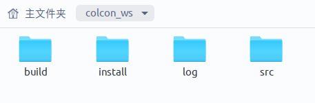
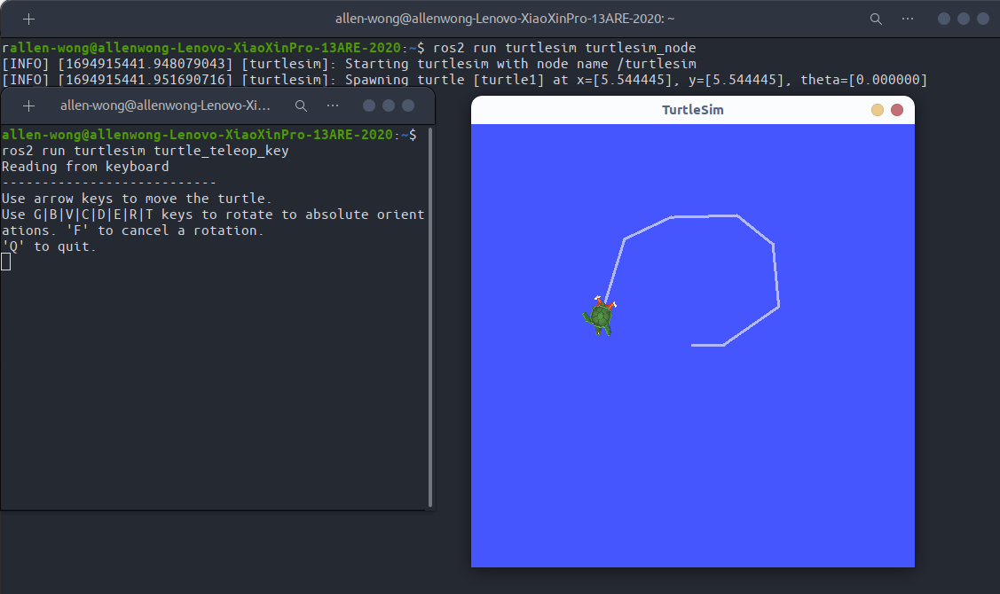

# Hello ROS2！


> ROS2 比 ROS1 多了一些概念
>


## ROS2对比ROS1的优势？

- 稳定
- 更好的实时性
- 更好的多平台兼容性
- 商业开发都在用

<br>

[ROS2 humble Documentation](https://docs.ros.org/en/humble/index.html)


---


## ROS2 安装

安装过程无非是添加ros的apt软件源，然后通过`sudo apt install ros-<ros-distro>-<package>`下载对应ubuntu发行版的ros版本的packages


---


## 创建你的colcon工作空间

colcon是ros2的开发编译系统，功能更加丰富，类似ros1的catkin tools。

```
$ mkdir -p ~/colcon_ws/src       
$ cd ~/colcon_ws/
$ colcon build
```

以上我们初始化了一个采用colcon编译系统的ROS2的workspace



可以看到，`colcon`的目录和`catkin`还是有区别的；`src`文件夹还是老样子,作为开发package时候用到的目录；`build`文件夹和ROS1基本一样构建ROS软件包的中间文件和构建脚本；`install`是ros1没有的，ros2目录的setup。bash存放在这里，而ros1的目录存放在`devel`目录里；


## Hello ROS2！

> 按照惯例，入门ROS先跑小海龟


安装turtlesim包
```
$ sudo apt install ros-humble-turtlesim
```

从ros1到ros2，基本的一些指令有变化，如：

`roscore`  --> `被砍掉了`

`rosrun` --> `ros2 run`

`roslaunch` --> `ros2 launch`    


`rostopic` --> `ros2 topic`

`rosservice` --> `ros2 service`

`rosparam` --> `ros2 param`


直接`ros2 run`启动turtlesim包中的节点就可以愉快玩耍了；





<br>
<br>
<br>

<center>
Created on September 17, 2023.
</center>

<br>
<br>
<br>
