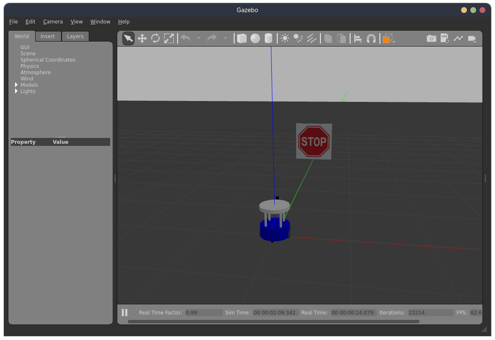
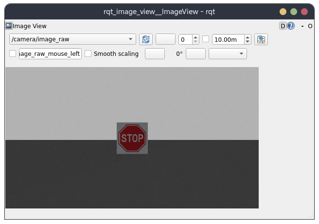

# Detection In Gazebo
> A Simulation Setup for image pattern detection task
>
> Author: Siyuan Wang, 2024

## Usage
- `ros2 launch detection_in_gazebo gazebo.launch.py`: Launch Gazebo Environment, then you can publish to topic `cmd_vel` to control the robot, subscribe `/camera/image_raw` to obtain the camera image

- An Useful script: 

  cd to `<path_to_detection_in_gazebo>/detection_in_gazebo/`, run `python3 image_capture.py`, which will gives you an UI interface, press `s` to save current image, `q` to quit. 

- For a quick check for the camera image, run `ros2 run rqt_image_view rqt_image_view`.

